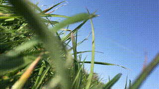
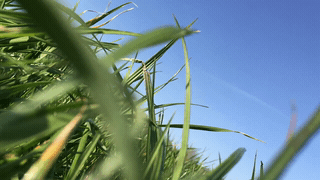

동영상을 GIF로 변환하는 방법은 여러가지입니다. 인코더나 포토샵 같은 프로그램, 온라인 변환 사이트를 이용하는 것이 가장 대중적인 방식이 아닐까 싶은데요. 하지만 비용에 대한 부담이나 영상을 온라인에 업로드한다는 찜찜함, 빈약한 설정 옵션 등의 불편함 때문에 (저처럼) 이 방법을 꺼리는 분들도 계실 수 있을 것 같습니다. 그럼 오늘은 macOS에서 FFmpeg와 bash script를 활용해 동영상을 GIF로 만드는 방법을 알아보겠습니다.

> 준비물: 터미널 앱, 홈브루

## FFmpeg 설치

FFmpeg는 비디오나 오디오 같은 멀티미디어에 관련된 다양한 작업을 할 수 있는 프레임워크입니다. 오픈소스 프로젝트인만큼 무료로 사용이 가능하다는 장점도 있습니다. 다음 명령어를 입력해 간단히 설치가 가능합니다.

```noLineNumbers
brew install ffmpeg
```

## FFmpeg 사용 예시

FFmpeg 설치가 끝났다면 반 이상 진행된 것이나 다름 없습니다! 이 단계에서 바로 영상을 GIF로 변환할 수도 있는데요 간단한 예시를 하나 보여드리겠습니다.

```noLineNumbers
ffmpeg -ss 10 -t 2.5 -i filename.mp4 -vf "fps=30,scale=640:-1" outfile.gif
```

* **-ss [position]**
  * 입력 파일의 [position]부터 인코딩합니다. 예시의 10은 입력 영상의 10초대부터 인코딩함을 뜻합니다.
* **-t [duration]**
  * [duration]만큼 인코딩합니다. 예시의 2.5는 2.5초만큼 인코딩함을 뜻합니다.
* **-i [input]**
  * 변환할 입력 파일을 지정합니다.
* **-vf "fps=[fps],scale="[width]:[height]"**
  * 출력 파일의 프레임 레이트를 [fps]로 지정합니다. 예시의 30은 30프레임으로 인코딩함을 뜻합니다.
  * 화면을 [width]:[height]로 리사이즈합니다. 이때 -1은 화면비에 맞춰 자동으로 사이즈를 결정해주겠다는 것을 뜻합니다. 예를 들어 입력 파일의 사이즈가 1280x720일 때, scale을 640:-1로 지정해주면 640x360의 결과물을 얻을 수 있습니다.
* **outfile.gif**
  * 출력 파일의 이름과 확장자를 지정합니다.

더 다양한 옵션이 궁금하시다면 [FFmpeg 공식 문서](https://ffmpeg.org/ffmpeg.html)를 읽어보시길 추천드립니다!

근데 가장 기본적인 옵션들인데도 상당히 복잡하지 않나요..? 게다가 좋은 결과물을 내기 위해선 이보다 더 세세하게 옵션을 지정해주어야 합니다. 특히 GIF 포맷 특성상 **256 컬러**밖에 지원하지 않기 때문에 색상 손실로 인해 화질이 더 안 좋아 보일 수밖에 없는데요. 이 문제를 해결하기 위해선 기본 팔레트가 아닌 원본 영상에 최적화된 팔레트를 사용해야 합니다. 예를 들어 하늘을 촬영한 영상이라면 풍부한 파란색을 담고 있는 팔레트가 필요하겠죠.

다행스럽게도 다른 분들이 이미 작성해둔 스크립트를 사용하면 직접 일일히 옵션을 지정할 필요 없이 쉽게 변환이 가능합니다.

## 쉬운 사용을 위한 밑작업

1. 터미널에서 다음 명령어를 입력해 셸 스크립트 파일을 만듭니다.

   ```noLineNumbers
   touch vid-to-gif.sh
   ```

2. 아래 코드를 복사해 둡니다.

   ```bash
   #!/bin/bash
   # rev4 - changes suggested by KownBash https://www.reddit.com/r/bash/comments/5cxfqw/i_wrote_a_simple_video_to_gif_bash_script_thought/da19gjz/
   
   # Usage function, displays valid arguments
   usage() { echo "Usage: $0 [-f <fps, defaults to 15>] [-w <width, defaults to 480] inputfile" 1>&2; exit 1; }
   
   # Default variables
   fps=15
   width=480
   
   # getopts to process the command line arguments
   while getopts ":f:w:" opt; do
       case "${opt}" in
           f) fps=${OPTARG};;
           w) width=${OPTARG};;
           *) usage;;
       esac
   done
   
   # shift out the arguments already processed with getopts
   shift "$((OPTIND - 1))"
   if (( $# == 0 )); then
       printf >&2 'Missing input file\n'
       usage >&2
   fi
   
   # set input variable to the first option after the arguments
   input="$1"
   
   # Extract filename from input file without the extension
   filename=$(basename "$input")
   #extension="${filename##*.}"
   filename="${filename%.*}.gif"
   
   # Debug display to show what the script is using as inputs
   echo "Input: $#"
   echo "Output: $filename"
   echo "FPS: $fps"
   echo "Width: $width"
   
   # temporary file to store the first pass pallete
   palette="/tmp/palette.png"
   
   # options to pass to ffmpeg
   filters="fps=$fps,scale=$width:-1:flags=lanczos"
   
   # ffmpeg first pass
   ffmpeg -v warning -i "$input" -vf "$filters,palettegen" -y $palette
   # ffmpeg second pass
   ffmpeg -v warning -i "$input" -i $palette -lavfi "$filters [x]; [x][1:v] paletteuse=dither=bayer:bayer_scale=3" -y "$filename"
   
   # display output file size
   filesize=$(du -h "$filename" | cut -f1)
   echo "Output File Name: $filename"
   echo "Output File Size: $filesize"
   ```

3. vim 편집기로 파일을 열어 복사해두었던 내용을 붙여넣고 저장합니다.

   ```noLineNumbers
   vim vid-to-gif.sh
   ```

4. 실행 권한을 부여합니다.

   ```noLineNumbers
   chmod +x vid-to-gif.sh
   ```

5. bin 폴더로 파일을 복사합니다.

   ```noLineNumbers
   cp vid-to-gif.sh /usr/local/bin
   ```

이 작업까지 끝나면 1번에서 만들었던 **vid-to-gif.sh** 파일은 지우셔도 괜찮습니다. 이제 GIF 변환을 위한 모든 준비가 끝났습니다!

## 명령어 사용하기

```noLineNumbers
vid-to-gif.sh -f 30 -w 640 filename.mp4
```

* **-f [fps]**
  * 출력 파일의 프레임 레이트를 [fps]로 지정합니다.
  * 프레임 레이트 기본값은 15fps로 생략이 가능합니다.
* **-w [width]**
  * 화면을 [width]에 맞춰 리사이즈합니다. 높이는 화면비에 따라 자동으로 결정됩니다.
  * 이미지 너비 기본값은 480으로 생략이 가능합니다.
* 출력 파일은 입력 파일과 같은 파일명으로 현재 디렉토리에 저장됩니다.

훨씬 직관적이지 않나요? 결과물은 어떨지 한번 봅시다.

| 방식      | FFmpeg                                                       | vid-to-gif.sh                                                |
| --------- | ------------------------------------------------------------ | ------------------------------------------------------------ |
| 결과물    |                                       |                            |
| FPS       | 15                                                           | 15                                                           |
| 파일 용량 | 609 KB                                                       | 1.5 MB                                                       |

비교해보면 오른쪽이 왼쪽에 비해 전반적인 퀄리티가 높고 그라데이션 표현도 자연스러운 것을 느낄 수 있습니다. 대신 아무래도 화질이 좋은만큼 파일 용량은 더 높네요.

출력 파일의 용량이 너무 크게 나올 때 저는 이미지 사이즈나 영상의 길이, fps를 줄이는 방식 등으로 용량을 떨어뜨립니다. 여러 값을 넣어보며 용량 대비 가장 좋은 결과물을 선택해 사용하고 있어요. 그때그때 상황과 목적에 맞게 사용하시면 어떨까 싶네요 :)

---

### 참고

* [ffmpeg + ImageMagick. Convert video to GIF by using Terminal.app in macOS](https://medium.com/acronis-design/ffmpeg-imagemagick-convert-video-to-gif-using-the-terminal-app-in-macos-657948adf900)
* [High quality GIF with FFmpeg](http://blog.pkh.me/p/21-high-quality-gif-with-ffmpeg.html)
* [FFmpeg](https://ffmpeg.org)
