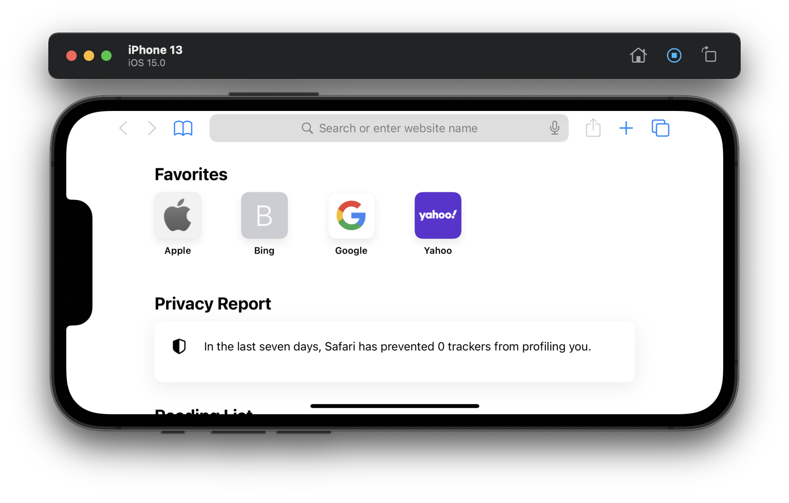
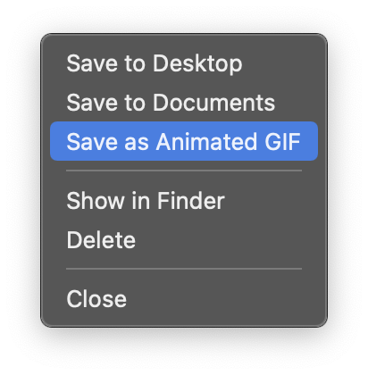
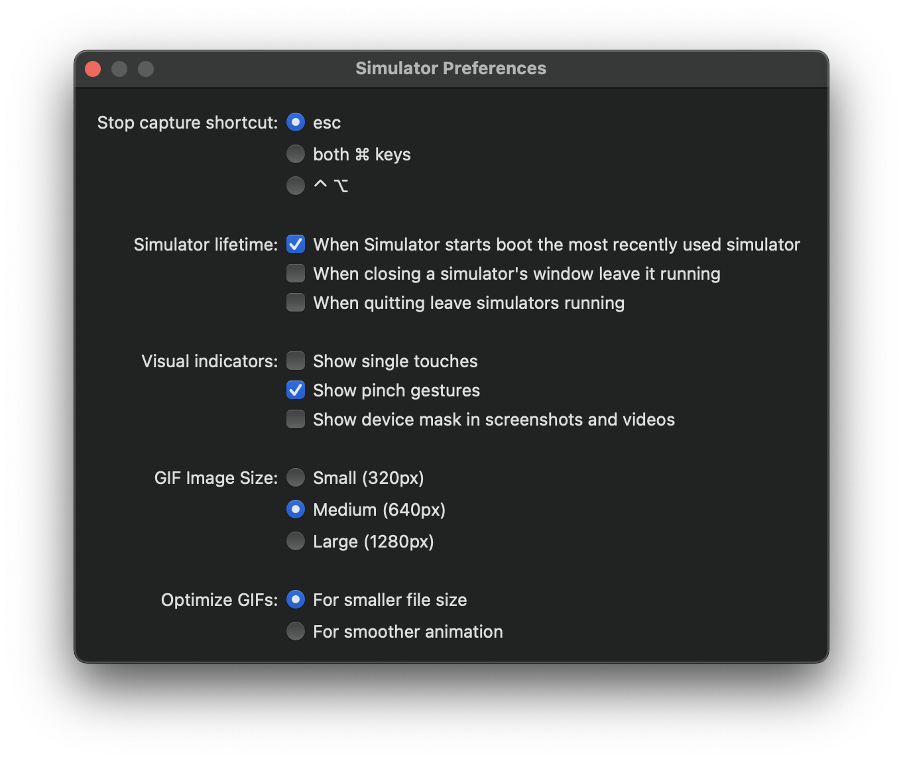

앱을 소개할 때 스크린샷만으로는 부족할 때가 많죠. 앱의 동작을 보여주는 영상이나 움직이는 이미지를 함께 제공하는 것이 훨씬 효과적인 경우가 대부분입니다. 오늘은 시뮬레이터로 화면을 녹화하고 바로 GIF로 저장하는 방법을 알아보겠습니다.

## 시뮬레이터에서 화면 녹화하기

올해 4월 릴리즈된 Xcode 12.5 버전부터는 시뮬레이터 앱에서 바로 화면 녹화가 가능합니다.

1. 시뮬레이터 앱을 켭니다.
2. 녹화를 시작하는 방법은 여러 가지입니다.
   * (옵션 1) 상단 메뉴바의 **File > Record Screen** 을 선택합니다. (단축키 `Command-R`)
   * (옵션 2) `Option` 키를 누르고 있으면 시뮬레이터 툴바 좌측 상단 스크린샷 버튼(카메라 아이콘 모양)이 녹화 버튼으로 변경됩니다. 변경된 버튼을 클릭합니다.
   * (옵션 3) 터치바가 있는 맥이라면 터치바에서도 녹화 버튼을 누를 수 있습니다.
3. 녹화 중에는 아래 스크린샷과 같이 녹화 버튼이 파란색으로 표시됩니다. 이 상태에서 녹화 버튼을 누르면 녹화가 종료됩니다.
   
4. 녹화가 정상적으로 마무리되면 시뮬레이터의 좌측 하단에 녹화했던 내용을 간단히 볼 수 있는 비디오 프리뷰가 나타납니다. 이때 아무런 행동을 하지 않으면 프리뷰는 수초 이내에 알아서 사라지고 녹화했던 영상은 자동으로 **Desktop**에 저장이 됩니다. 파일 포맷은 mp4입니다.

## 녹화한 영상 바로 GIF로 저장하기

프리뷰가 사라지기 전 좌클릭하면 저장 위치 변경, 영상 삭제 등 몇 가지 메뉴를 선택할 수 있는 창이 나타납니다.



**Save as Animated GIF**를 선택하면 녹화했던 영상이 GIF 포맷으로 **Desktop**에 저장됩니다. 이 경우 mp4 포맷의 영상은 따로 남아있지 않게 된다는 점 참고해 주세요! 만약 mp4와 GIF 포맷 둘 다 저장하고 싶다면 `Option` 키를 눌러 **Save Copy as Animated GIF**로 메뉴가 변경되는 것을 확인한 후 선택하시면 됩니다.

## Preferences



상단 메뉴바의 **Simulator > Preferences...** 을 선택해 간단한 환경설정을 직접 해줄 수도 있습니다. (단축키 `Command-쉼표(,)`)

참고로 Small, Medium, Large 옆에 있는 픽셀들은 Portrait 모드 기준 파일의 높이를 뜻합니다. (사실 Landscape 모드의 화면을 녹화해도 결과물은 Portrait으로 나옵니다. 제대로 Landscape으로 보여주기 위해선 결과물을 회전시켜줘야 합니다.)

바로 간편하게 GIF로 저장할 수 있다는 점이 매력적이긴 하지만… 선택할 수 있는 옵션이 제한적이라 개인적으로는 잘 사용하지 않는 방법이에요. 다음 글에서는 FFmpeg와 bash script를 사용해 영상을 GIF로 변환하는 법에 대해서 이야기해 보겠습니다.

## (번외) 터미널 앱으로 시뮬레이터 화면 녹화하기

시뮬레이터에 화면 녹화 기능이 추가되기 전에는 터미널 앱을 이용해 녹화를 하곤 했습니다.

1. 시뮬레이터 앱을 켭니다.
2. 터미널에서 아래 명령어를 입력한 다음 Return을 누릅니다.
   ```noLineNumbers
   xcrun simctl io booted recordVideo <file_name>.<file_extension>
   ```
   예를 들면 `xcrun simctl io booted recordVideo myVideo.mov` 이런 식입니다.
3. 터미널에 *Recording started*가 출력되며 녹화가 시작됩니다.
4. 시뮬레이터로 이동해 녹화할 내용을 시연합니다.
5. 시연이 끝나면 터미널로 돌아와 `control-C`를 눌러 녹화를 종료합니다.
6. 녹화된 영상은 터미널에서 현재 내가 위치하고 있는 디렉토리에 저장됩니다. (`pwd` 명령어로 현재 디렉토리를 확인할 수 있습니다.)

---

### 참고

* [Xcode 12.5 Release Notes](https://developer.apple.com/documentation/xcode-release-notes/xcode-12_5-release-notes)
* [Record iOS Simulator video as mp4 and GIF with Xcode](https://sarunw.com/posts/record-ios-simulator-video-and-gif-with-xcode/)
* [Take a screenshot and record a video in iOS Simulator](https://sarunw.com/posts/take-screenshot-and-record-video-in-ios-simulator/)
